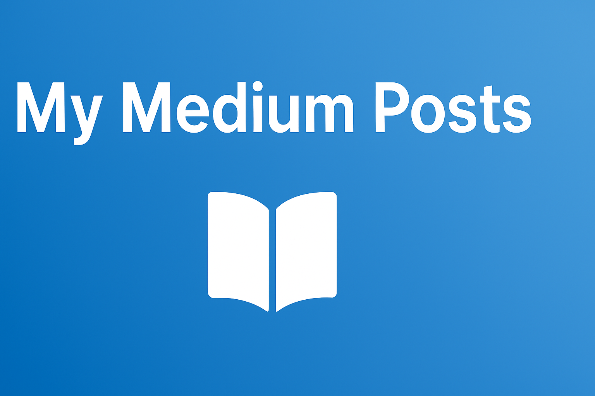

# My Medium Posts 

Welcome! Here I share my latest writings on Data Science, Machine Learning, and Analytics. Below are my **featured posts** and a link to my full Medium profile.  

---

## Featured Posts

1. **Who I am?**
   
    Here I discuss my journey, my current career stage, and what I aim to achieve → [Read more](https://medium.com/@thiago.guimaraes.sto/who-am-i-536d9f9dfd02)
   
2. **Quem sou eu?**

   Aqui eu falo sobre minha trajetória, meu momento de carreira e o que busco → [Read more](https://medium.com/@thiago.guimaraes.sto/quem-sou-eu-e838b2dd7a91)
   
3. **Data Science in Three Dimensions: Input, Procedure, and Results (I, P, R)**

   A structured approach to solving data science problems by organizing data, hypotheses, methodology, and settings  → [Read more](https://medium.com/@thiago.guimaraes.sto/thinking-about-data-science-structurally-the-quadruple-d-h-m-s-781eee1af2ff)
   
4. **Understanding Web Scraping: Navigating the Complexities of Extracting Data Online**

   Here I explore different ways of web scraping → [Read more](https://medium.com/@thiago.guimaraes.sto/understanding-web-scraping-navigating-the-complexities-of-extracting-data-online-8fc4f588279a)
   
5. **The Magic of Modular Arithmetic: How Mathematicians and Programmers See It Differently**

   Here I show how programmers and mathematicians approach the same problem differently, with mathematicians often drawn to the underlying structures rather than just the numbers → [Read more](https://medium.com/@thiago.guimaraes.sto/the-magic-of-modular-arithmetic-how-mathematicians-and-programmers-see-it-differently-a96929f114b8)

---

## All Posts

Check out all my Medium writings here: [My Medium Profile](https://medium.com/@thiago.guimaraes.sto)
